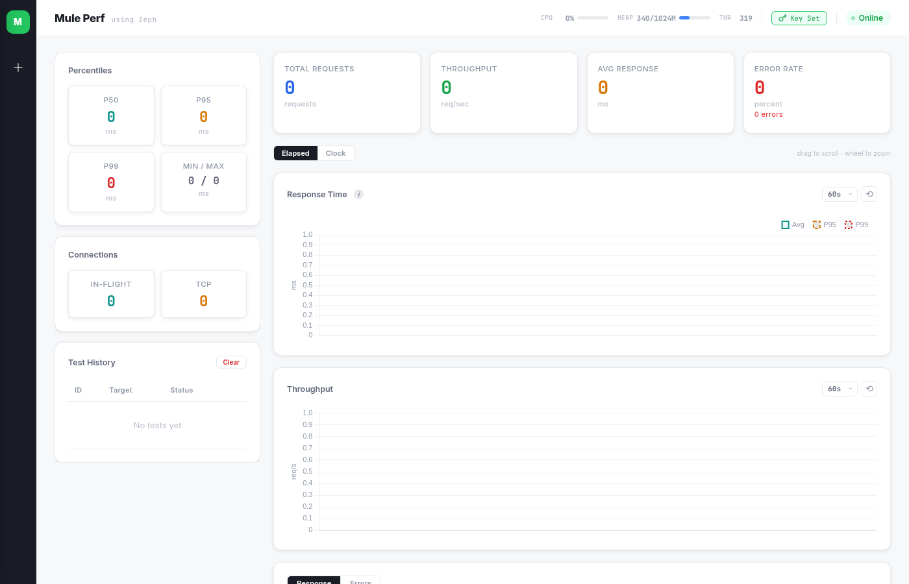
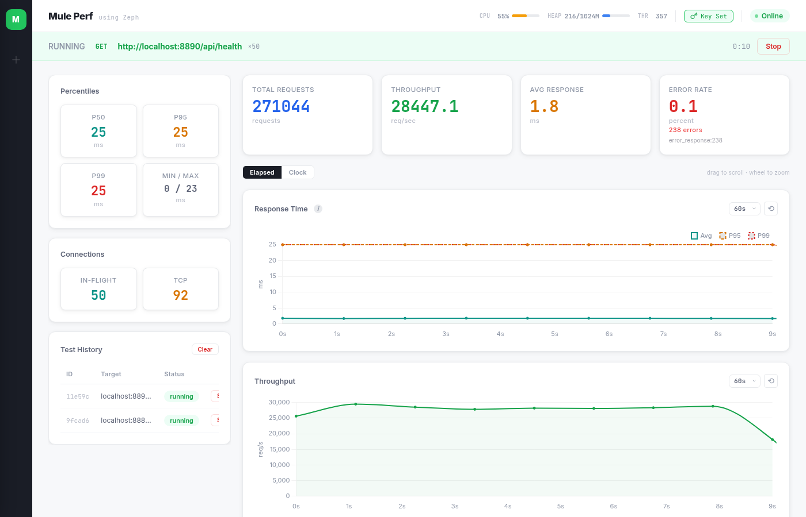

# mule-perf

A high-performance HTTP load testing tool built on MuleSoft Mule 4, featuring a real-time dashboard with Chart.js.

All load generation runs in Java using [Zeph](https://gitlab.com/myst3m/zeph) NIO HTTP client with async `CompletableFuture` chains — zero threads per connection, lock-free metrics, ms-precision percentiles. [Validated against hey](#accuracy-validation-vs-hey) with ±3% RPS accuracy.



## Features

- **Async NIO load engine** — N concurrent request chains via CompletableFuture (no thread-per-connection)
- **Real-time dashboard** — 1-second polling, response time / throughput charts, error distribution
- **Warmup support** — exclude initial requests from metrics
- **Error classification** — timeout, connection refused/reset, HTTP 4xx/5xx breakdown
- **Connection monitoring** — in-flight requests, TCP socket count
- **Precise percentiles** — P50/P90/P95/P99 computed from raw latency recording (ms precision)
- **Test management** — create, stop, list, clear tests via REST API
- **HTML report generation** — downloadable single-file HTML report with KPIs and charts
- **System metrics** — heap, CPU, threads, file descriptors, TCP sockstat
- **Exec key security** — one-shot key generation for OS command execution endpoint
- **OS command execution** — debug endpoint for runtime inspection (requires exec key)

## Architecture

```
Browser (index.html)
  |  1s polling
  v
Mule 4 API Router (api-main.xml)
  |  choice-based routing
  v
Java LoadRunner (static methods called from DataWeave)
  |  CompletableFuture chains
  v
Zeph NIO HTTP Client --> Target System
```

All state lives in Java (`LoadRunner.TestState`). No ObjectStore, no external dependencies beyond HTTP connector.

## Quick Start

### Prerequisites

- Java 17
- Maven 3.x
- Mule Runtime 4.6+ (standalone or CloudHub 2)

### Build

```bash
JAVA_HOME=/usr/lib/jvm/java-17-openjdk-amd64 \
  mvn clean package -DskipTests -DattachMuleSources
```

### Run

Deploy the built JAR to your Mule runtime, then open:

```
http://localhost:8888/
```

### API

| Method | Path | Description |
|--------|------|-------------|
| `GET` | `/` | Dashboard UI |
| `POST` | `/api/tests` | Start a load test |
| `GET` | `/api/tests` | List all tests |
| `GET` | `/api/tests/{id}/metrics` | Get real-time metrics |
| `DELETE` | `/api/tests/{id}` | Stop a test |
| `DELETE` | `/api/tests` | Clear finished tests |
| `POST` | `/api/test-connection` | One-shot connectivity check |
| `GET` | `/api/system` | System metrics (heap, CPU, threads) |
| `POST` | `/api/exec-key` | Generate exec key (one-shot, locked until redeploy) |
| `GET` | `/api/exec-key` | Check if exec key is set |
| `POST` | `/api/exec` | Execute OS command (requires exec key) |
| `GET` | `/api/health` | Health check |

### Start a test

```bash
curl -X POST http://localhost:8888/api/tests \
  -H "Content-Type: application/json" \
  -d '{
    "targetUrl": "http://localhost:8081/api/health",
    "method": "GET",
    "concurrency": 100,
    "duration": 30,
    "warmup": 5
  }'
```

### Exec Key Security

The OS command execution endpoint (`POST /api/exec`) is a debug feature for inspecting the deployment environment (e.g., hostname, disk usage). It is not required for normal load testing operations.

If no exec key has been set, this endpoint will reject all requests.

1. Click the **Exec Key** button in the dashboard top bar to generate a key
2. The key is displayed once — click the green area to copy it
3. The key cannot be regenerated until the app is redeployed
4. `GET /api/exec-key` only returns `{set: true/false}`, never the key itself

```bash
# Execute a command with the key
curl -X POST http://localhost:8888/api/exec \
  -H "Content-Type: application/json" \
  -d '{"command": "hostname", "key": "your-exec-key-here"}'
```

## Project Structure

```
src/main/
  mule/
    global-config.xml              # HTTP listener/requester config
    api-main.xml                   # API router (choice-based)
    impl/
      test-management.xml          # Create/list/get/stop tests
      load-executor.xml            # Test connection flow
      metrics-collector.xml        # Metrics retrieval
      static-server.xml            # Dashboard HTML serving
  java/mule_perf/
    LoadRunner.java                # Async load engine + metrics
  resources/
    static/index.html             # Dashboard UI (single file)
    config/config-local.yaml      # Port and timeout config
```

## Metrics Response

```json
{
  "testId": "abc-123",
  "status": "running",
  "totalRequests": 15420,
  "successCount": 15300,
  "errorCount": 120,
  "responseTime": {
    "avg": 62.3, "min": 2, "max": 1450,
    "p50": 45, "p90": 98, "p95": 112, "p99": 203
  },
  "throughput": { "rps": 1540.5 },
  "errorRate": 0.78,
  "statusCodes": { "2xx": 15300, "5xx": 120 },
  "errorDetail": { "503": 95, "timeout": 25 },
  "inFlight": 100,
  "connections": { "active": 8, "tcp": 12, "pending": 0 },
  "timeSeries": [
    { "timestamp": 1709856000000, "rps": 1520, "avgRt": 65.2, "errors": 3 }
  ],
  "histogram": [
    { "label": "0-50ms", "count": 8200 },
    { "label": "50-100ms", "count": 4100 }
  ]
}
```

## Dashboard UI



- **Stats cards** — Total requests, RPS, avg response time, error rate + error count + breakdown
- **Connections** — In-flight requests, TCP socket count
- **Percentiles sidebar** — P50, P95, P99, min/max
- **Response time chart** — Per-second average with P95/P99 reference lines
- **Throughput chart** — Requests per second over time
- **Response Distribution** tab — Status code doughnut + response time histogram
- **Errors** tab — Horizontal bar chart of error types (timeout, 503, conn_reset, etc.)
- **Test history** — List of past tests with Report button
- **Time controls** — Elapsed vs absolute time, timezone selector, chart window (30s-10m)
- **Zoom/pan** — Drag to scroll, mouse wheel to zoom on charts

## Accuracy Validation (vs hey)

mule-perf の計測精度を [hey](https://github.com/rakyll/hey) (Go製HTTPロードジェネレータ) とクロスバリデーションで検証。
同一 CloudHub 2 Pod 上で同一ターゲットに対して同条件 (c=50, 60s) で実行し比較。

**テスト環境:** mule-perf 1 vCore → bench-target 0.1 vCore (内部URL, HTTP直接)

| Scenario | Tool | RPS | P50 ms | P90 ms | P95 ms | P99 ms | Total |
|----------|------|-----|--------|--------|--------|--------|-------|
| Echo | hey | 841 | 88 | 99 | 102 | 120 | 50,570 |
| | mule-perf | 839 | 89 | 98 | 101 | 113 | 50,370 |
| | **diff** | **-0.3%** | +1ms | -1ms | -1ms | -7ms | |
| Small DW | hey | 723 | 93 | 101 | 104 | 187 | 43,372 |
| | mule-perf | 701 | 94 | 101 | 105 | 183 | 42,059 |
| | **diff** | **-3%** | +1ms | 0ms | +1ms | -4ms | |
| Heavy DW | hey | 153 | 304 | 400 | 405 | 496 | 9,217 |
| | mule-perf | 144 | 309 | 404 | 487 | 503 | 8,683 |
| | **diff** | **-6%** | +5ms | +4ms | +82ms | +7ms | |

**結論:**
- RPS は ±6% 以内で一致。Echo/Small DW は ±3% とほぼ同一
- P50/P90/P99 は数ms以内の差で一致
- Heavy DW P95 のみ 82ms の乖離があるが、テール分布のサンプリング差と推定
- mule-perf は hey と同等の精度を持つ信頼できるロードジェネレータ

## Tech Stack

| Layer | Technology |
|-------|-----------|
| Runtime | MuleSoft Mule 4.10.1 |
| Load Engine | Java 17 + Zeph 0.3.3 NIO |
| Async Model | CompletableFuture chains |
| Metrics | AtomicLong + ConcurrentHashMap (lock-free) |
| Frontend | Vanilla JS + Chart.js 4.4.7 |
| Styling | CSS custom properties, light theme |

## License

Eclipse Public License 2.0
